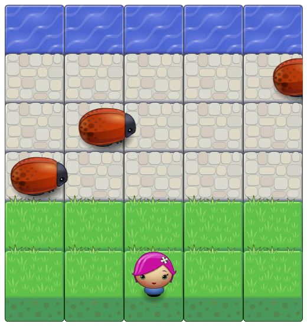

# FEND-Arcade-Game
GwG Udacity Project 3 FEND Arcade Game

# Arcade Game Project

- This is a fun game to test your ability to move fast and avoid obstacles 
- Click [HERE](https://goo.gl/j9FNQc) to play the game
- To load the game locally: clone the repository and open index.html in a browser

## How to Play

- In this game we have a player and bugs as enemies
- Enemies move in varying speeds
- Player can move up, down, left, and right by using the arrow keys
- To win the game, player has to reach the water without colliding to one of the enemies
- Whenever player and enemy collide, player will return to the original position
- When player reaches the water, a Congratulation banner will show up
- Click OK to play the game again
- Good Luck!
  
## Licence

This project is done as part of the Grow with Google Front-End Web Developer Nanodegree program by [Udacity](https://www.udacity.com).
